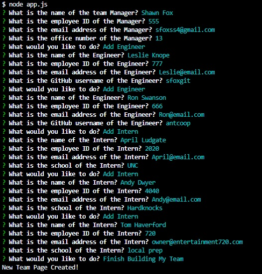
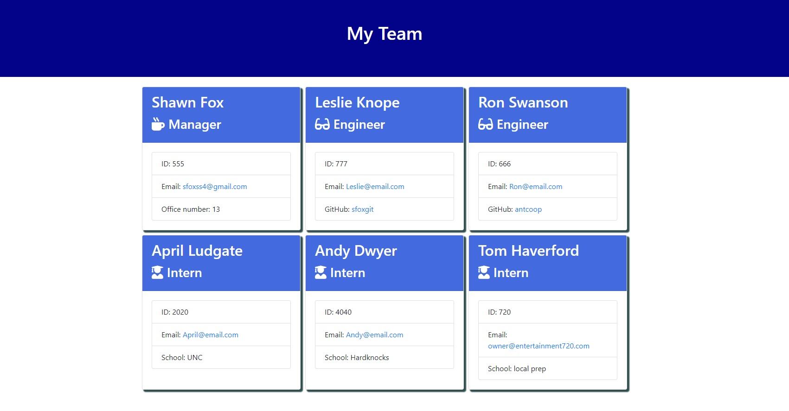

# Team_Profile_Generator
Using Inquirer to prompt user to input details about employee and generate an html to display an entire team. Use Jest to test.

---
## Author

Shawn Fox

| [GitHub](https://github.com/SFoxGit) | [Email](sfoxss4@gmail.com) |

---
## Project Links:

- Deployed site: Not Deployed, is node app.
- GitHub: [SFoxGit](https://github.com/SFoxGit/Team_Profile_Generator)

---
## Table of Contents

- [Description](##Description)

- [Installation](##Installation)
  
- [Usage](##Usage)
  
- [Tests](##Tests)

- [Requirements](##Requirements)

- [Contributions](##Contributing)

- [Credits](##Credits)

---
## Description

Answer command line prompts about the employees within your team and this team profile generator will create an HTML for you with their information.

---
## Installation

Required: Nodejs

Clone the repo - change into the directory - enter "npm i" into the command line (this will install jest and inquirer) - enter "node app.js" into command line - follow the prompts - your new team profile html will be in a folder created called output!

---
## Usage

Teams must consist of one Manager, number of interns and engineers can varry. Once you've created the html file via prompts move it wherever you'd like it!

---
## Tests

Using Jest to ensure each class Employee, Manager, Engineer, Intern have the necessary keys in the constructor, the constructor works, and the functions can be called from them. See test folder. With Jest installed run npm test in the command line

---
## Requirements

AS A manager
I WANT to generate a webpage that displays my team's basic info
SO THAT I have quick access to their emails and GitHub profiles

GIVEN a command-line application that accepts user input
WHEN I am prompted for my team members and their information
THEN an HTML file is generated that displays a nicely formatted team roster based on user input
WHEN I click on an email address in the HTML
THEN my default email program opens and populates the TO field of the email with the address
WHEN I click on the GitHub username
THEN that GitHub profile opens in a new tab
WHEN I start the application
THEN I am prompted to enter the team manager’s name, employee ID, email address, and office number
WHEN I enter the team manager’s name, employee ID, email address, and office number
THEN I am presented with a menu with the option to add an engineer or an intern or to finish building my team
WHEN I select the engineer option
THEN I am prompted to enter the engineer’s name, ID, email, and GitHub username, and I am taken back to the menu
WHEN I select the intern option
THEN I am prompted to enter the intern’s name, ID, email, and school, and I am taken back to the menu
WHEN I decide to finish building my team
THEN I exit the application, and the HTML is generated

---
### Must include:

The application must include Employee, Manager, Engineer, and Intern classes. The tests for these classes (in the tests directory) must ALL pass.

---
## Contributing

Please contact me if you'd like to contribute

---
## Credits

SBoudrias - Inquirer.js

@fbjest - Jestjs

Anthony Cooper (Instructor) & Maxwell Allee (TA) - for starter code!